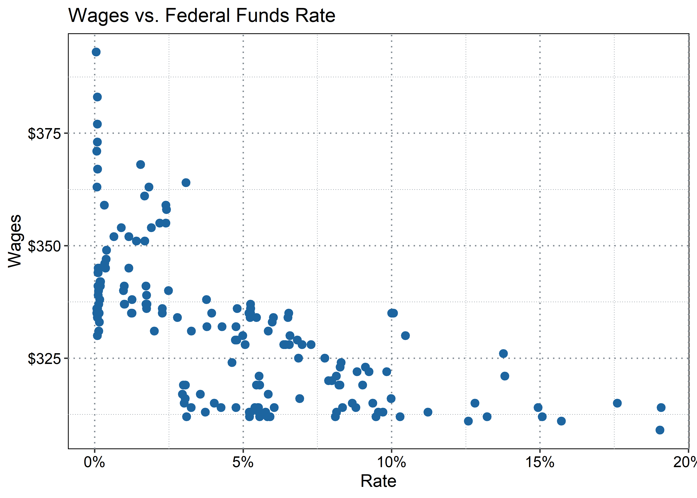
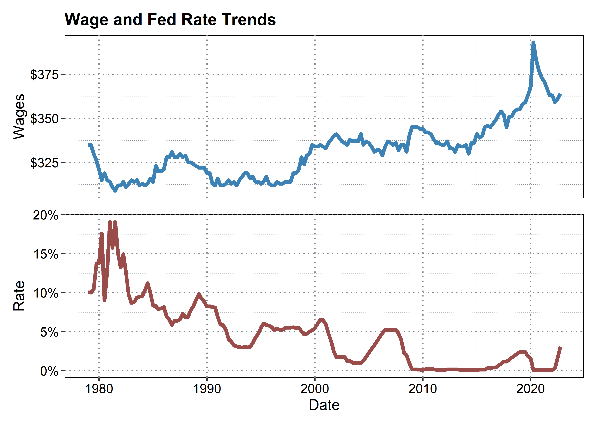
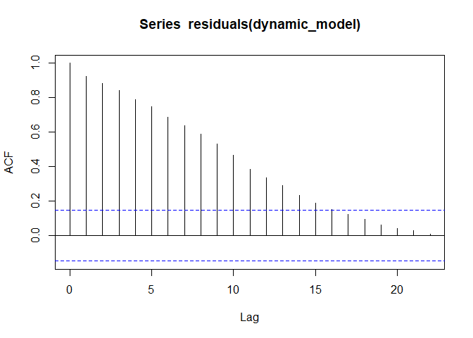

## R Markdown

As I addressed in [this piece of short
writing](https://www.blogger.com/blog/post/edit/7082565423545917807/6331764398954459332),
economists have noted a relationship between a low Federal Funds Rate
(FFR) and high average worker earnings in the United States. While the
piece examined this trend in both the 1990’s and 2000’s, I’m only going
to analyze data for the latter period (in part for simplicity’s sake,
and in part because the 1990’s data presents a more multifaceted picture
that I believe would require some more advanced analytics to
understand).

As I noted in the linked piece, [UNC Economics professor Karl Smith
argues](https://www.bloomberg.com/opinion/articles/2019-05-02/u-s-worker-productivity-is-up-and-the-fed-should-pay-attention)
that a Federal Funds Rate that drops below the NAIRU, in this case 5%,
is correlated with an increase in real wages. Naturally there are
numerous different factors that impact wage growth, but for this
analysis, I’ll just be exploring the relationship between these two
variables.

I’ll be using time series panel datasets to test this hypothesis; the
data consists of [the value of the Federal Funds rate, reported
quarterly](https://fred.stlouisfed.org/series/FEDFUNDS), and [the median
usual weekly earnings of workers over the age of sixteen, reported
monthly](https://fred.stlouisfed.org/series/LES1252881600Q). While we’re
primarily examining the trend post-2008, I’ve included data from 1981 to
2020 to gain a better understanding of the long-term relationship
between these two variables.

First, I’ll visualize the data. This scatterplot compares the two
datasets:

We can see just from this that higher wages tend to cluster around a
lower FFR. A line graph depicting these trends over time suggests the
same, with a declining FFR depicted in red above, and increasing wages
depicted in blue below:

However, we’re not simply testing whether a lower federal funds rate
correlates with lower wages, but rather, whether the federal funds rate
dropping below a certain value correlates with a higher rate of wage
growth. If this is true, we would expect this data to be nonstationary.

We’ll run an autocorrelation test on my wage dataset to help visualize
this:

We can see the lags are well correlated with each other, implying
nonstationarity.

Next, we’ll apply a Dickey-Fuller test:

    ## 
    ## ############################################### 
    ## # Augmented Dickey-Fuller Test Unit Root Test # 
    ## ############################################### 
    ## 
    ## Test regression drift 
    ## 
    ## 
    ## Call:
    ## lm(formula = z.diff ~ z.lag.1 + 1)
    ## 
    ## Residuals:
    ##     Min      1Q  Median      3Q     Max 
    ## -9.3873 -2.0270 -0.1601  1.6372 25.2960 
    ## 
    ## Coefficients:
    ##             Estimate Std. Error t value Pr(>|t|)
    ## (Intercept)  4.36616    5.52252   0.791    0.430
    ## z.lag.1     -0.01267    0.01664  -0.762    0.447
    ## 
    ## Residual standard error: 3.554 on 173 degrees of freedom
    ## Multiple R-squared:  0.003341,   Adjusted R-squared:  -0.00242 
    ## F-statistic: 0.5799 on 1 and 173 DF,  p-value: 0.4474
    ## 
    ## 
    ## Value of test-statistic is: -0.7615 0.4802 
    ## 
    ## Critical values for test statistics: 
    ##       1pct  5pct 10pct
    ## tau2 -3.46 -2.88 -2.57
    ## phi1  6.52  4.63  3.81

With a p-value of 0.4474, we cannot reject the null-hypothesis that the
data is non-stationary.

Finally, we’ll apply a KPSS test:

    ## 
    ##  KPSS Test for Trend Stationarity
    ## 
    ## data:  data$wages
    ## KPSS Trend = 0.32185, Truncation lag parameter = 4, p-value = 0.01

With a p-value of 0.01, we can reject the null hypothesis that the data
is stationary. With these three tests in mind, we can assume that the
impact of the Federal Funds rate on wages is not consistent over time.

First, let’s run a dynamic regression to look at the overall trend
between the FFR and wages:

    ## 
    ## t test of coefficients:
    ## 
    ##              Estimate Std. Error t value  Pr(>|t|)    
    ## (Intercept) 343.21692    1.39935 245.269 < 2.2e-16 ***
    ## fed_rate     -2.50751    0.22563 -11.113 < 2.2e-16 ***
    ## ---
    ## Signif. codes:  0 '***' 0.001 '**' 0.01 '*' 0.05 '.' 0.1 ' ' 1

The low p-values observed in this regression imply that a 0.01 increase
in the federal funds rate corresponds to a $2.51 *decrease* in real
weekly wages. However, keep in mind that this is looking at all data
from 1979 to 2022.

Given the non-stationarity of the data, if Professor Smith’s argument is
correct, we should see a break in the FFR coefficient for data observed
once the Federal Funds Rate crosses below 5. During the 2008 recession,
this occurred in the third quarter of 2007:

    ## 
    ## t test of coefficients:
    ## 
    ##              Estimate Std. Error  t value Pr(>|t|)    
    ## (Intercept) 347.42580    2.24901 154.4793   <2e-16 ***
    ## fed_rate      0.53993    1.73780   0.3107   0.7571    
    ## ---
    ## Signif. codes:  0 '***' 0.001 '**' 0.01 '*' 0.05 '.' 0.1 ' ' 1

We see that, for data post-2008, the trend is reversed. A 0.01
percentage-point increase in the federal funds rate corresponds to a
$0.54 *increase* in real weekly wages. However, with a p-value of
0.7571, these findiungs are not statistically significant.
